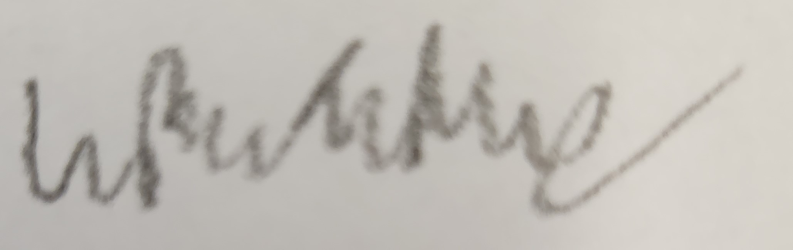
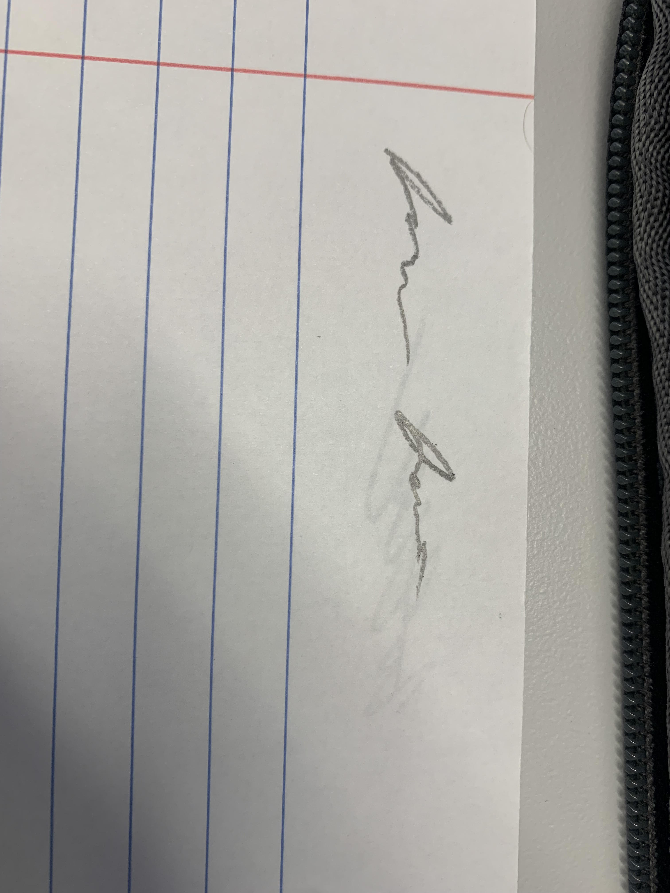
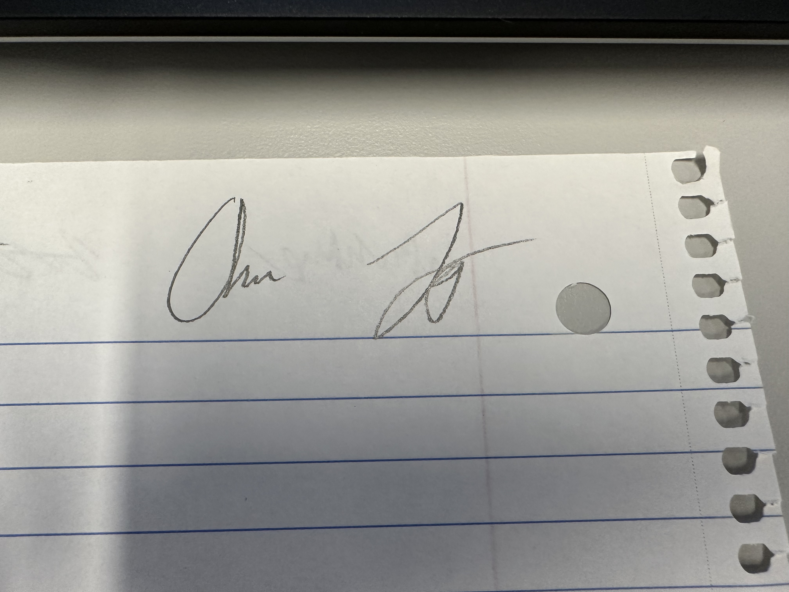

# Contributor Covenant Code of Conduct

## Our Pledge

We as members, contributors, and leaders pledge to make participation in our
community a harassment-free experience for everyone, regardless of age, body
size, visible or invisible disability, ethnicity, sex characteristics, gender
identity and expression, level of experience, education, socio-economic status,
nationality, personal appearance, race, caste, color, religion, or sexual
identity and orientation.

We pledge to act and interact in ways that contribute to an open, welcoming,
diverse, inclusive, and healthy community.

## Our Standards

Examples of behavior that contributes to a positive environment for our
community include:

* Demonstrating empathy and kindness toward other people
* Being respectful of differing opinions, viewpoints, and experiences
* Giving and gracefully accepting constructive feedback
* Accepting responsibility and apologizing to those affected by our mistakes,
  and learning from the experience
* Focusing on what is best not just for us as individuals, but for the overall
  community

Examples of unacceptable behavior include:

* The use of sexualized language or imagery, and sexual attention or advances of
  any kind
* Trolling, insulting or derogatory comments, and personal or political attacks
* Public or private harassment
* Publishing others' private information, such as a physical or email address,
  without their explicit permission
* Other conduct which could reasonably be considered inappropriate in a
  professional setting

## Enforcement Responsibilities

Community leaders are responsible for clarifying and enforcing our standards of
acceptable behavior and will take appropriate and fair corrective action in
response to any behavior that they deem inappropriate, threatening, offensive,
or harmful.

Community leaders have the right and responsibility to remove, edit, or reject
comments, commits, code, wiki edits, issues, and other contributions that are
not aligned to this Code of Conduct, and will communicate reasons for moderation
decisions when appropriate.

## Scope

This Code of Conduct applies within all community spaces, and also applies when
an individual is officially representing the community in public spaces.
Examples of representing our community include using an official email address,
posting via an official social media account, or acting as an appointed
representative at an online or offline event.

## Enforcement

Instances of abusive, harassing, or otherwise unacceptable behavior may be
reported to the community leaders responsible for enforcement at
uriCSC305@gmail.com.
All complaints will be reviewed and investigated promptly and fairly.

All community leaders are obligated to respect the privacy and security of the
reporter of any incident.

## Enforcement Guidelines

Community leaders will follow these Community Impact Guidelines in determining
the consequences for any action they deem in violation of this Code of Conduct:

### 1. Correction

**Community Impact**: Use of inappropriate language or other behavior deemed
unprofessional or unwelcome in the community.

**Consequence**: A private, written warning from community leaders, providing
clarity around the nature of the violation and an explanation of why the
behavior was inappropriate. A public apology may be requested.

### 2. Warning

**Community Impact**: A violation through a single incident or series of
actions.

**Consequence**: A warning with consequences for continued behavior. No
interaction with the people involved, including unsolicited interaction with
those enforcing the Code of Conduct, for a specified period of time. This
includes avoiding interactions in community spaces as well as external channels
like social media. Violating these terms may lead to a temporary or permanent
ban.

### 3. Temporary Ban

**Community Impact**: A serious violation of community standards, including
sustained inappropriate behavior.

**Consequence**: A temporary ban from any sort of interaction or public
communication with the community for a specified period of time. No public or
private interaction with the people involved, including unsolicited interaction
with those enforcing the Code of Conduct, is allowed during this period.
Violating these terms may lead to a permanent ban.

### 4. Permanent Ban

**Community Impact**: Demonstrating a pattern of violation of community
standards, including sustained inappropriate behavior, harassment of an
individual, or aggression toward or disparagement of classes of individuals.

**Consequence**: A permanent ban from any sort of public interaction within the
community.

## Decisions

All decisions will be made via a majority consensus. The person who's presenting the idea's vote will not count.

## Attendance

We expect each member of the team to attend every scheduled meeting and Monday's project section. If a team member is unable to meet, the member must let the team know 24 hours in advance unless if it's an emergency. If you miss a meeting, you must confirm that you read the notes of the meeting that you missed.

## Assignments

Assignments will be based on the proficiency of specific skills as well as general interest during SCRUM meetings. If a team member misses an assignment or does it poorly, it will be brought up in the next SCRUM meeting or via team groupchat. If the team member repeatedly fail or doesn't fix the previous assignment, we will contact uriCSC305@gmail.com

## Participation

We will communicate big ideas through SCRUM meetings, as well as the team group chat. We will split the workload evenly based on team member's interest and proficiencies.

## Meeting Times and Locations/Mediums
We will conduct a poll in our group chat on what times we are available, and then based on the poll we will schedule a ZOOM meeting unless we're all available in the library at a given time.

## Agenda and Minutes/Notes
Ryan will take notes and minutes during meetings and they will be shared through sharing a google doc.

## Promptness
We expect everyone to be on time to each meeting and for everyone to finish the tasks given to them in the allocated time period/sprint.

 If a team member is late to a meeting without prior notice three times, uriCSC305@gmail.com will be contacted. 
 
 
 
 If a team member is struggling on their tasks and doesn't finish at the deadline and doesn't let the team know on three occasions, uriCSC305@gmail.com will be contacted.

## Conversational Courtesies
During team meetings, the first half of each meeting will give each team member allocated time to talk and give their ideas. The second half will be an active discussion about the project. 

## Enforcement/Feedback 
During each meeting, team members who's behavior is in question will be brought up to that member face to face in the next team meeting. All members will receive and give major feedback face to face, minor feedback will be done via groupchat.

## Attribution

This Code of Conduct is adapted from the [Contributor Covenant][homepage],
version 2.1, available at
[https://www.contributor-covenant.org/version/2/1/code_of_conduct.html][v2.1].

Community Impact Guidelines were inspired by
[Mozilla's code of conduct enforcement ladder][Mozilla CoC].

For answers to common questions about this code of conduct, see the FAQ at
[https://www.contributor-covenant.org/faq][FAQ]. Translations are available at
[https://www.contributor-covenant.org/translations][translations].

[homepage]: https://www.contributor-covenant.org
[v2.1]: https://www.contributor-covenant.org/version/2/1/code_of_conduct.html
[Mozilla CoC]: https://github.com/mozilla/diversity
[FAQ]: https://www.contributor-covenant.org/faq
[translations]: https://www.contributor-covenant.org/translations

